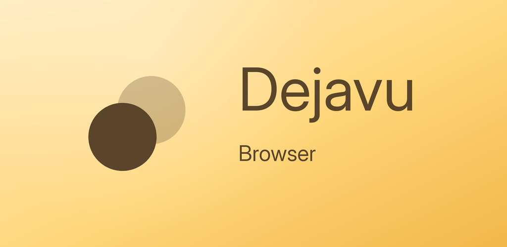
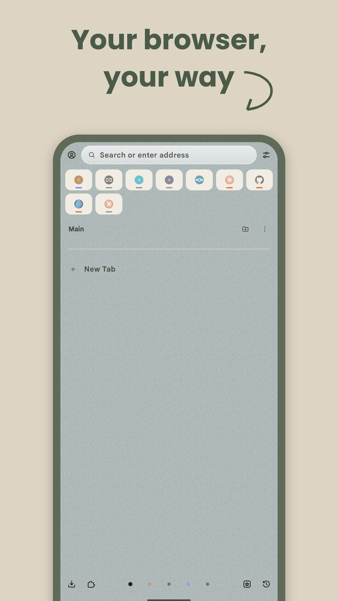
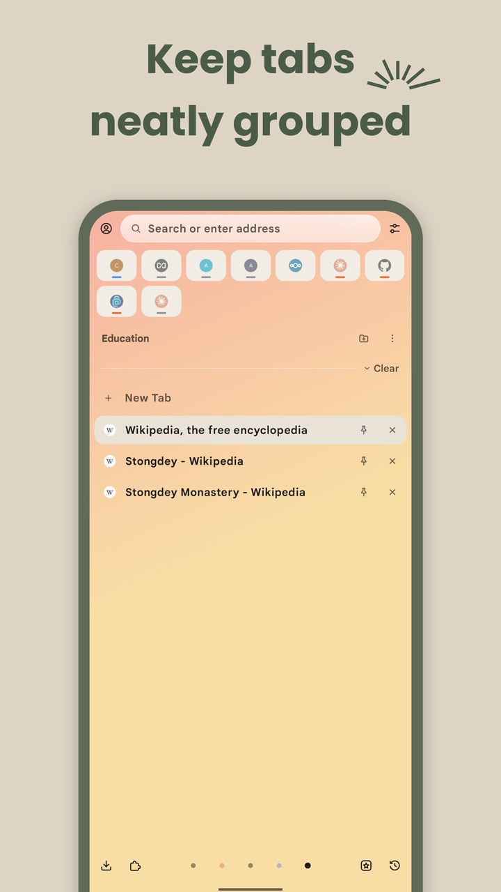
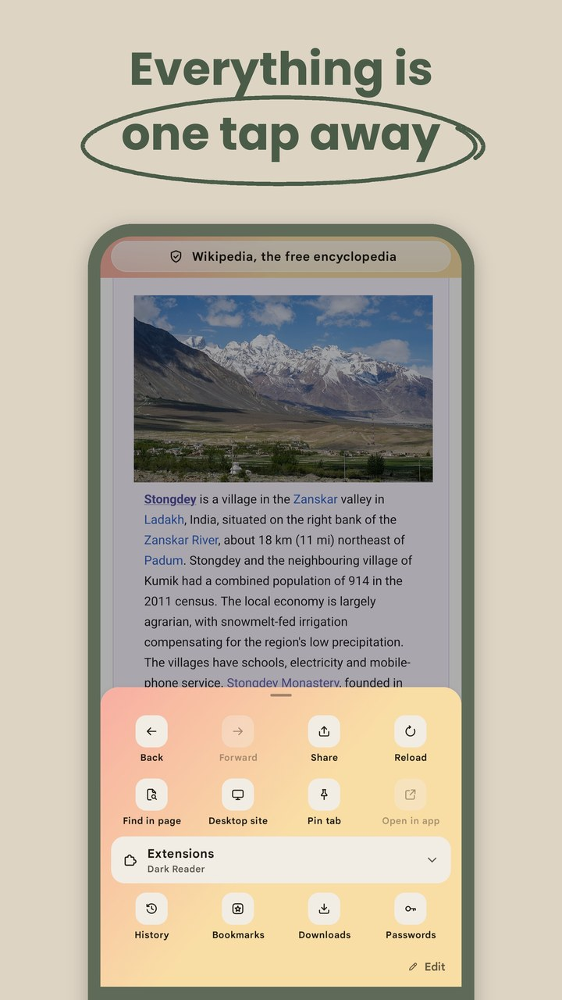
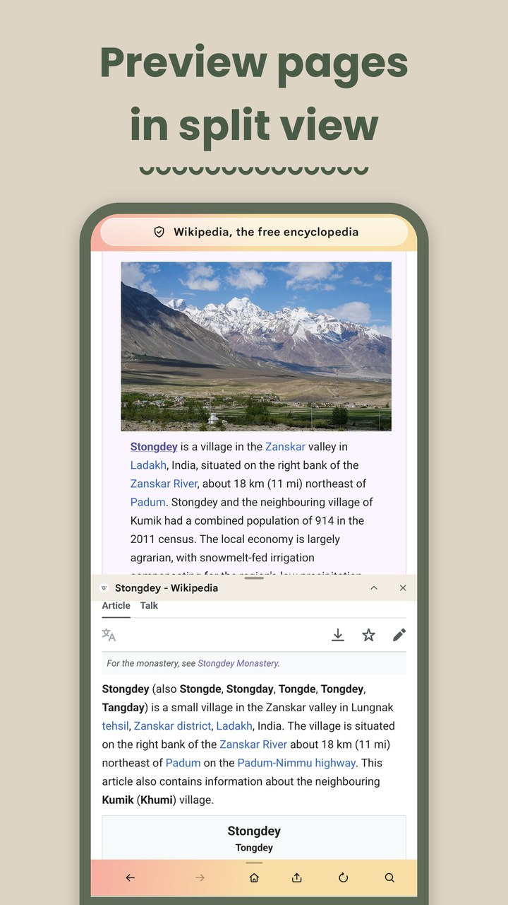

  

  <strong>A calm Android browser built on Firefox, with workspaces, containers, split view and sync with Zen Browser.</strong>

  
  
  
  
  

Dejavu keeps your tabs organized the way Zen Browser does on the desktop: in workspaces, with pinned tabs, essentials
and folders. It is built on Firefox, so you get the same Gecko engine, add-ons and tracking protection, and it is
private by default.

If you use Zen on your computer, Dejavu syncs your workspaces, containers, pinned tabs, essentials and folders with it
through your Mozilla account. Everything is where you left it, on every device. That feeling of having been here
before is where the name comes from.

  
  
  
  

## Download

**Android:** Dejavu is in testing on Google Play right now. The public release is planned in about three weeks,
around late October 2026. It needs Android 8.0 or newer. Star this repository to follow along.

**iOS:** We are working on an iOS app. News about it will be shared here.

## Features

- **Workspaces:** Keep work, study and personal browsing apart. Each workspace has its own icon, color theme and tabs,
  and you swipe between them. A private workspace keeps private tabs in one place.
- **Pinned tabs, essentials and folders:** Pin the tabs you come back to, sort them into folders, and keep your
  favorite sites as essentials at the top of the home screen.
- **Containers:** Tabs in a container keep their own cookies and site data, so you can stay signed in to two accounts
  at once. A workspace can open all its tabs in a container. Temporary containers delete their data after their last
  tab is closed.
- **Split view:** Open a link in split view to see two pages at once, or preview a page without leaving the one you
  are reading.
- **Sync with Zen Browser:** Your workspaces, with their colors and icons, containers, pinned tabs, essentials and
  folders stay the same in Zen on your computer and in Dejavu on your other devices. Unpinned tabs can sync too.
- **Everything one tap away:** The actions bar below every page opens a menu with all actions. Choose its buttons, and
  add your own tab actions.
- **Links from other apps:** Choose the workspace and container that links from other apps open in.
- **Private by default:** Telemetry, studies, search suggestions and sponsored content are off until you turn them
  on, and there are no ads.
- **Firefox inside:** Add-ons like uBlock Origin and Dark Reader, Enhanced Tracking Protection, and Firefox Sync for
  bookmarks, history and passwords.

### Set up sync with Zen

1. Sign in to the same Mozilla account in Zen on your computer and in Dejavu.
2. In Zen, open **Settings**, then **Sync**, and turn on sidebar sync.
3. In Dejavu, open **Settings**, then **Sync with Zen**, and turn on **Sync workspaces**.
4. To sync the tabs that are not pinned as well, turn on **Include unpinned tabs** in both Dejavu and Zen.

## Report a bug or request a feature

Feedback goes through [GitHub issues](https://github.com/by-architect/Dejavu/issues). When you
[open an issue](https://github.com/by-architect/Dejavu/issues/new/choose), pick a template and it starts the title for
you:

| Title starts with   | Use it for                                                         |
| ------------------- | ------------------------------------------------------------------ |
| `[BUG]`             | Something is broken or does not work as expected                   |
| `[FEATURE REQUEST]` | An idea or an improvement                                          |
| `[DESIGN]`          | A design, icon pack, theme or other artwork you want to contribute |
| `[SPONSOR]`         | Sponsoring Dejavu                                                  |

Please search the existing issues first. If yours is already there, add a thumbs up reaction to it instead of opening
a new one. Security problems should be reported privately, as [SECURITY.md](SECURITY.md) explains.

Pull requests are welcome too. Start the title with the kind of change, `[FIX]`, `[FEATURE]`, `[DESIGN]`,
`[TRANSLATION]` or `[DOCS]`, and link the issue it solves. [CONTRIBUTING.md](CONTRIBUTING.md) has the details.

## Contributing

Dejavu is open to contributions of every kind, and we would especially love help with design:

- **Design:** screens, flows and small details that make Dejavu calmer and easier to use.
- **Icon packs:** Dejavu draws its own icon set. New icons, alternative icon packs and app icons are very welcome.
- **Themes:** new color themes for workspaces.
- **Translations:** corrections for Dejavu's own texts in your language.
- **Code:** bug fixes and new features.
- **Testing:** try Dejavu on your phone or tablet and tell us what breaks.

[CONTRIBUTING.md](CONTRIBUTING.md) explains how each of these works and how to build Dejavu.

## Sponsors

Dejavu is independent, free and open source, and it has no ads. If you enjoy it, you can buy us a coffee:

We are also open to sponsors. If you or your company want to support Dejavu, open a
[sponsorship issue](https://github.com/by-architect/Dejavu/issues/new?template=sponsorship.yml) and we will get in
touch.

## Build from source

This repository is a fork of Mozilla's Firefox repository. The Android app is in `mobile/android/fenix`, and Dejavu's
own code is in the `org.mozilla.fenix.dejavu` package. The steps to build it and run it on a phone are in
[CONTRIBUTING.md](CONTRIBUTING.md#build-dejavu).

## Privacy

Dejavu does not collect your data. The [privacy policy](PRIVACY.md) explains what stays on your device and what the
optional features, like sync, share with Mozilla and your search engine.

## License

Dejavu is licensed under the [Mozilla Public License 2.0](LICENSE), like Firefox. Some third-party parts of the code
have their own licenses, listed in [toolkit/content/license.html](toolkit/content/license.html).

Dejavu is an independent project, not made or endorsed by Mozilla or the Zen Browser team. Firefox is a trademark of
the Mozilla Foundation, and this repository grants no rights to Mozilla's trademarks.

## Star history

<a href="https://star-history.com/#by-architect/Dejavu&Date">
  <picture>
    <source media="(prefers-color-scheme: dark)" srcset="https://api.star-history.com/svg?repos=by-architect/Dejavu&type=Date&theme=dark">
    
  </picture>
</a>
