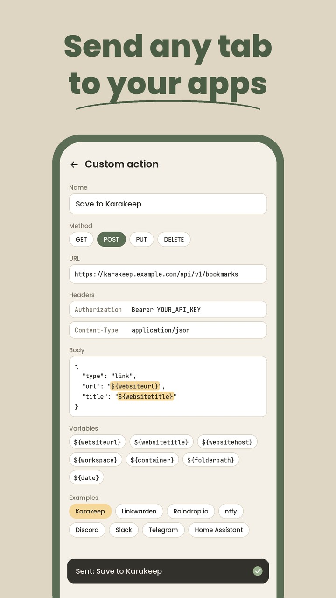

  

  <strong>Your tabs, right where you left them.</strong> 
  An independent Android browser with workspaces, containers and split view.

  
  
  
  
  
  

Dejavu is a browser that adapts to you. Send any tab to your own apps with one tap, edit every button in the menu,
choose where links from other apps open, and keep work, study and personal browsing apart in workspaces and
containers. It runs on the Gecko engine, supports add-ons and tracking protection, and it is private by default.

Open Dejavu and everything is where you left it, on every device. That feeling of having been here before is where
the name comes from.

  
  
  
  

## An independent browser

Dejavu is an independent project. It started as a fork of Firefox for Android (Fenix), Mozilla's open source mobile
browser, but it is not a Firefox product, and it is not made, endorsed or supported by Mozilla.

Dejavu is not part of Zen Browser either. It can sync with Zen, so if you use Zen on your computer, your workspaces show
up on your phone too, but the two are separate apps made by separate people. Sync is the only thing they share.

## Download

Dejavu needs Android 8.0 or newer on a 64-bit phone, which almost every phone from recent years is.

**F-Droid (recommended):** Dejavu is in the ByArchitect F-Droid repository, and F-Droid keeps it up to date. In
F-Droid, open **Repositories**, tap **+** and scan the QR code, or open
[this link](https://fdroid.byarchitect.org/fdroid/repo?fingerprint=50941BDAC56B056A520ABFA3FC7DAAB789DEE5B83B295DA54A1961C7BC8A91C9)
on your phone to add the repository. Then search for Dejavu.

**APK:** download `dejavu-<version>-arm64-v8a.apk` from the
[latest release](https://github.com/by-architect/Dejavu/releases/latest). It does not update itself, so use F-Droid
to get new versions.

**Google Play:** in testing right now. The public release is planned for late October 2026.

**iOS:** We are working on an iOS app. News about it will be shared here.

## Roadmap

See what is done, what is being worked on and what comes next. The picture follows the
[Dejavu Roadmap](https://github.com/users/by-architect/projects/1) board and updates itself; tap it to open the board.

## Features

Dejavu is made of small things that save you time every day.

### Send any tab to your apps

Turn any web service into a button. A custom action sends the page you are on, or every tab you selected, to an app
or server you choose: save it to your read-later app, post it in a chat, send it to your phone as a notification or
start a home automation.

- Write the request once: the method, URL, headers and body, like a `curl` command.
- Fill it in with the page's address, title and site, or its workspace, container, folder and the date, using
  variables such as `${websiteurl}`.
- Start from a ready-made example for Karakeep, Linkwarden, linkding, Readeck, Raindrop.io, Memos, ntfy, Gotify,
  Discord, Slack, Telegram, Home Assistant or any webhook.
- Put the action in the menu, on the buttons of each tab, or on the bar you see when you select several tabs.

 

### Make the menu yours

- **Edit every button:** Add, remove and move any button in the menu, add new rows, and put your own custom actions
  between them.
- **Choose your actions bar:** Pick the buttons of the actions bar below every page, Home and Search included, so the
  buttons you use most are always one tap away.
- **One list of actions:** Every action, your own included, is in one list. Put each one on pinned tabs, other tabs,
  folders, the bar for selected tabs, the menu or the actions bar. An action on a folder reaches every tab inside it.

### Open links from other apps where they belong

Choose the workspace and container that links from other apps open in: always the same workspace, the one you saw
last, or a private tab. Back takes you straight back to the app you came from.

### Keep everything in its place

- **Workspaces:** Keep work, study and personal browsing apart. Each workspace has its own icon, color theme and tabs,
  and you swipe between them. A private workspace keeps private tabs in one place.
- **Pinned tabs, essentials and folders:** Pin the tabs you come back to, sort them into folders, and keep your
  favorite sites as essentials at the top of the home screen.
- **Containers:** Tabs in a container keep their own cookies and site data, so you can stay signed in to two accounts
  at once. A workspace can open all its tabs in a container. Temporary containers delete their data after their last
  tab is closed.
- **Split view:** Open a link in split view to see two pages at once, or preview a page without leaving the one you
  are reading.

### And more

- **Sync with Zen Browser:** Your workspaces, with their colors and icons, containers, pinned tabs, essentials and
  folders stay the same in Zen on your computer and in Dejavu on your other devices. Unpinned tabs can sync too.
- **Private by default:** Telemetry, studies, search suggestions and sponsored content are off until you turn them
  on, and there are no ads.
- **Gecko engine:** Add-ons like uBlock Origin and Dark Reader, Enhanced Tracking Protection, and sync for bookmarks,
  history and passwords through your Mozilla account.

### Set up sync with Zen

1. Sign in to the same Mozilla account in Zen on your computer and in Dejavu.
2. In Zen, open **Settings**, then **Sync**, and turn on sidebar sync.
3. In Dejavu, open **Settings**, then **Sync with Zen**, and turn on **Sync workspaces**.
4. To sync the tabs that are not pinned as well, turn on **Include unpinned tabs** in both Dejavu and Zen.

## Report a bug or request a feature

Feedback goes through [GitHub issues](https://github.com/by-architect/Dejavu/issues). When you
[open an issue](https://github.com/by-architect/Dejavu/issues/new/choose), pick a template and it starts the title for
you:

| Title starts with   | Use it for                                       |
| ------------------- | ------------------------------------------------ |
| `[BUG]`             | Something is broken or does not work as expected |
| `[FEATURE REQUEST]` | An idea or an improvement                        |

New issues show up on the [Dejavu Roadmap](https://github.com/users/by-architect/projects/1) board, where you can
follow what happens to them.

Please search the existing issues first. If yours is already there, add a thumbs up reaction to it instead of opening
a new one. Security problems should be reported privately, as [SECURITY.md](SECURITY.md) explains.

Pull requests are welcome too. Start the title with the kind of change, `[FIX]`, `[FEATURE]`, `[DESIGN]`,
`[TRANSLATION]` or `[DOCS]`, and link the issue it solves. [CONTRIBUTING.md](CONTRIBUTING.md) has the details.

## Contact

For sponsorship, designs, icon packs, themes, or anything that is not a bug report or a feature request, email
[byarchitect@disroot.org](mailto:byarchitect@disroot.org).

## Contributing

Dejavu is open to contributions of every kind, and we would especially love help with design:

- **Design:** screens, flows and small details that make Dejavu simpler and easier to use.
- **Icon packs:** Dejavu draws its own icon set. New icons, alternative icon packs and app icons are very welcome.
- **Themes:** new color themes for workspaces.
- **Translations:** corrections for Dejavu's own texts in your language.
- **Code:** bug fixes and new features.
- **Testing:** try Dejavu on your phone or tablet and tell us what breaks.

Send designs, icon packs and themes to [byarchitect@disroot.org](mailto:byarchitect@disroot.org), or open a pull
request. [CONTRIBUTING.md](CONTRIBUTING.md) explains how each of these works and how to build Dejavu.

## Sponsors

Dejavu is independent, free and open source, and it has no ads. If you enjoy it, you can buy us a coffee:

We are also open to sponsors. If you or your company want to support Dejavu, email [byarchitect@disroot.org](mailto:byarchitect@disroot.org) and we will get
in touch.

## Build from source

This repository is a fork of Mozilla's Firefox repository, kept up to date with it, but Dejavu is developed separately
from Mozilla. The Android app is in `mobile/android/fenix`, and Dejavu's
own code is in the `org.mozilla.fenix.dejavu` package. The steps to build it and run it on a phone are in
[CONTRIBUTING.md](CONTRIBUTING.md#build-dejavu).

## Privacy

Dejavu does not collect your data. The [privacy policy](PRIVACY.md) explains what stays on your device and what the
optional features, like sync, share with Mozilla and your search engine.

## License

Dejavu is licensed under the [Mozilla Public License 2.0](LICENSE), like Firefox. Some third-party parts of the code
have their own licenses, listed in [toolkit/content/license.html](toolkit/content/license.html).

Dejavu is an independent project, not made or endorsed by Mozilla or the Zen Browser team. Firefox is a trademark of
the Mozilla Foundation, and this repository grants no rights to Mozilla's trademarks.

## Star history

<a href="https://star-history.com/#by-architect/Dejavu&Date">
  <picture>
    <source media="(prefers-color-scheme: dark)" srcset="https://api.star-history.com/svg?repos=by-architect/Dejavu&type=Date&theme=dark">
    
  </picture>
</a>
